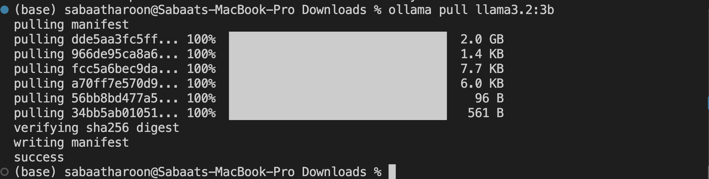
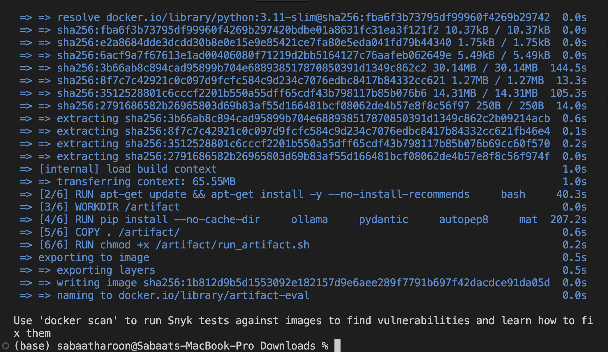
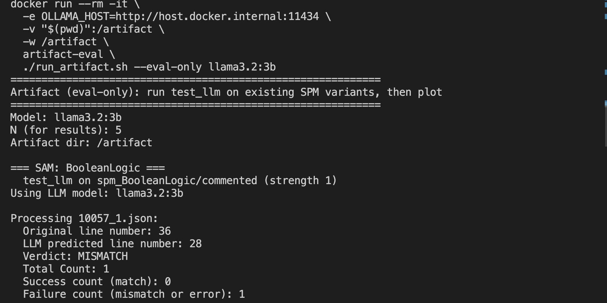
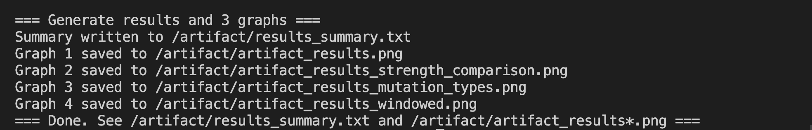
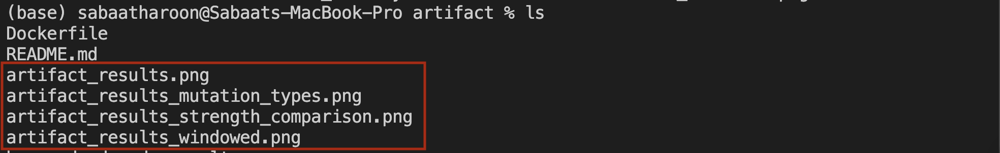
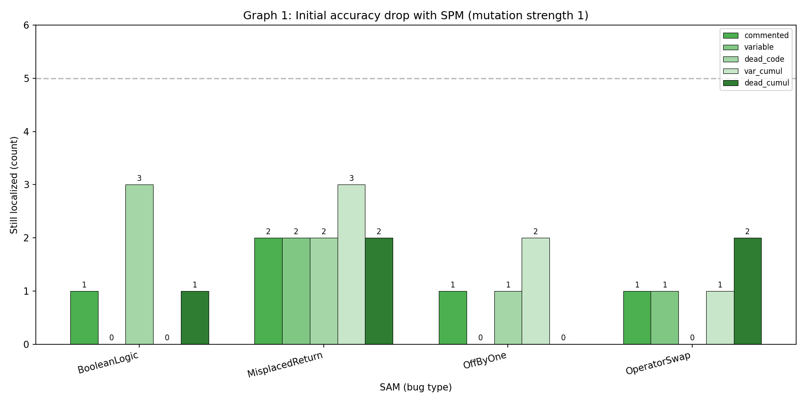
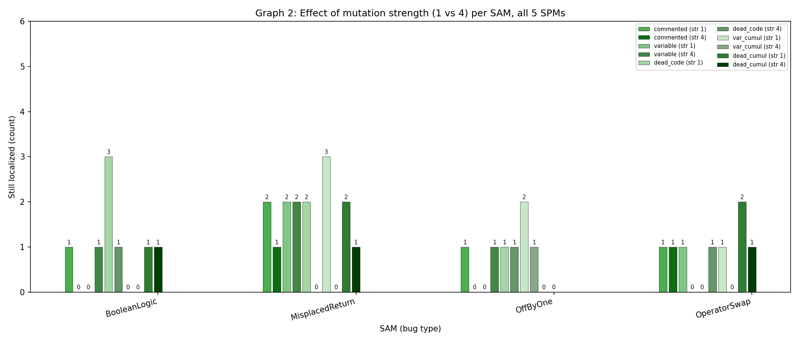
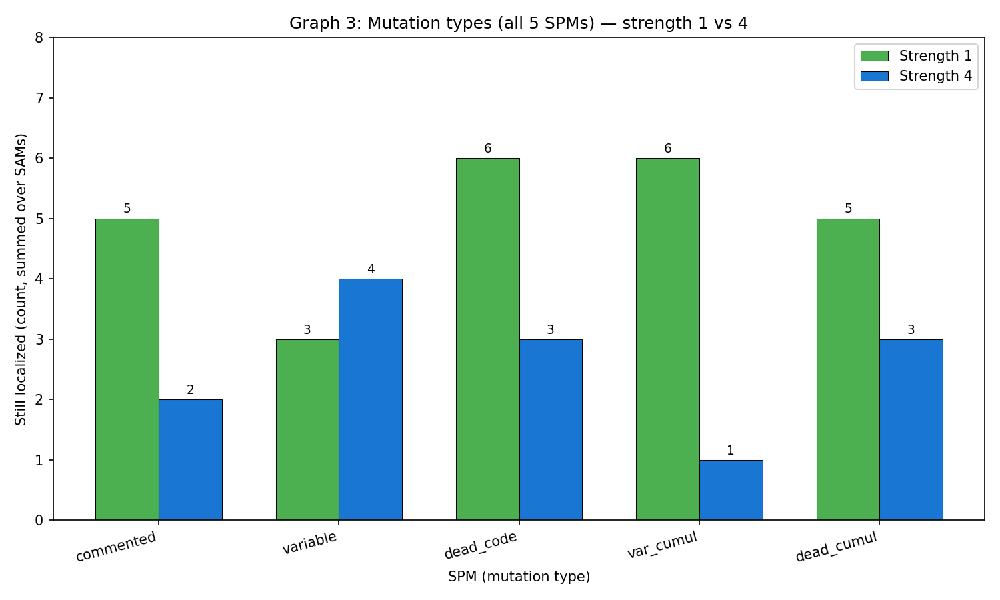

# Assessing the Impact of Code Changes on the Fault Localizability of Large Language Models

**Paper:** [arXiv Preprint](https://arxiv.org/abs/2504.04372)  
**Artifact Archive:** Zenodo Record 
**Authors:** Sabaat Haroon, Ahmad Faraz Khan, Ahmad Humayun, Waris Gill, Abdul Haddi Amjad, Ali R. Butt, Mohammad Taha Khan, Muhammad Ali Gulzar

------------------------------------------------------------------------

# 1. Purpose
This work provides the experimental framework used to conduct the first large-scale empirical investigation into the robustness of Large Language Models' (LLMs) fault localization (FL) capabilities. While LLMs are increasingly used for software maintenance, our research reveals that their performance is often tied to surface-level syntactic cues rather than true program semantics.

This artifact provides:

Robustness Testing: A framework to apply Semantic-Preserving Mutations (SPMs), such as misleading comments, misleading variable names, or dead code, to evaluate if the model's fault localization accuracy remains unaffected.

Reproducibility: Pre-configured scripts to replicate the findings of RQ1, RQ2, and RQ3 as presented in the paper.

Extensibility: Instructions to add custom datasets and test new models via Ollama or proprietary APIs.


------------------------------------------------------------------------

# 2. Provenance

Paper: ICST 2026 (Accepted) 

Archived Artifact: Zenodo DOI: 

GitHub Repository: [GitHub](https://github.com/SEED-VT/LLMCodeImpact)

License: MIT

------------------------------------------------------------------------

# 3. System Requirements

## Minimum (Artifact Evaluation Mode)

-   Docker
-   Ollama installed on host
-   12GB RAM recommended
-   No GPU required for quick mode

## Full Paper Reproduction

-   GPU required
-   Java installed (for Java pipeline)
-   Larger runtime expected

------------------------------------------------------------------------

# 4. Setup

## 4.1 Install Docker

Check installation:
``` bash
    docker --version
```
If not installed:

-   Linux: https://docs.docker.com/engine/install/
-   macOS/Windows: https://www.docker.com/products/docker-desktop/

------------------------------------------------------------------------

## 4.2 Install Ollama

-   Download from https://ollama.com/download

Pull model:
``` bash
    ollama pull llama3.2:3b
```


------------------------------------------------------------------------

# 5. Quick Evaluation (15--20 Minutes)

Runs evaluation on pre-generated data.

## Step 1 --- Build Docker Image

From repository root:
``` bash
    docker build -t artifact-eval ./artifact
```


------------------------------------------------------------------------

## Step 2 --- Run Quick Evaluation

### Linux

``` bash
    cd artifact
    chmod +x run_artifact.sh
    docker run --rm -it --network host   -v "$(pwd)":/artifact   -w /artifact   artifact-eval   ./run_artifact.sh --eval-only llama3.2:3b
```
### macOS / Windows
``` bash
    cd artifact
    chmod +x run_artifact.sh
    docker run --rm -it   -e OLLAMA_HOST=http://host.docker.internal:11434   -v "$(pwd)":/artifact   -w /artifact   artifact-eval   ./run_artifact.sh --eval-only llama3.2:3b
```
Expected terminal output at the start of run:



    Wait for 10 to 15 minutes for run to complete. This will be at the end of a successful run.



------------------------------------------------------------------------

# 7. Expected Output Files

After completion, the `artifact/` directory will contain:

-   `results_summary.txt`
-   `artifact_results.png`
-   `artifact_results_strength_comparison.png`
-   `artifact_results_mutation_types.png`
-   `artifact_results_windowed.png`




------------------------------------------------------------------------

# 8. Interpreting Results

## RQ1 --- Robustness to SPMs
For each bug type (SAM), how many of the N programs were still correctly localized after each of the five SPMs (mutation strength 1)
Open:

    artifact_results.png

Example:


## RQ2 --- Effect of Mutation Type & Strength
- For each bug type (SAM), localization success at mutation strength 1 vs 4 for each of the five SPMs.
- Total number of programs still correctly localized by SPM type, summed over all bug types, at strength 1 vs 4

Open:

    artifact_results_strength_comparison.png
    artifact_results_mutation_types.png

Example:



## RQ3 --- Effect of Fault Location
Cumulative count of correct (matches) vs incorrect (mismatches) localizations by bug position in the file.
Open:

    artifact_results_windowed.png

Example:


------------------------------------------------------------------------

# 9. Full Pipeline (Will require longer runtime based on N - 30 min+)

Regenerates SPMs and recomputes first N programs:
``` bash
    ./run_artifact.sh llama3.2:3b 5
```
Default N = 5.

------------------------------------------------------------------------

# 10. Java Pipeline

Requires Java installed on host:
``` bash
    cd artifact_java
    chmod +x run_artifact.sh run-experiments.sh
    ./run_artifact.sh llama3.2:3b
```
------------------------------------------------------------------------

# 11. Full Paper Reproduction (RQ4, RQ5)
``` bash
    ./run_paper_python.sh llama3.2:3b
```
Long runtime. GPU required.

------------------------------------------------------------------------

# 12. Adding Your Own Python or Java Projects

Each buggy program must be one JSON file containing:

  Field             Type     Description
  ----------------- -------- ---------------------------
  instruction       string   Intended behavior
  buggy_code        string   Full source code with bug
  line_no           number   1-based bug line
  line_no_percent   string   Percentage location

Example:

``` json
{
  "instruction": "Return the sum of two integers.",
  "buggy_code": "def add(a, b):\n    return a - b\n",
  "line_no": 2,
  "line_no_percent": "100"
}
```

Place dataset folders inside:

-   `artifact/` for Python
-   `artifact_java/` for Java

Or mount a custom directory during Docker execution.

------------------------------------------------------------------------

# 13. How This Artifact Meets ICST Criteria

### Artifact Available

-   Fully packaged with Docker
-   All scripts included

### Artifact Reviewed

The artifact is:

Documented: Includes installation steps, execution commands (quick and full modes), expected outputs, and dataset format specification.

Consistent: Directly implements the evaluation framework and reproduces the paper’s reported results.

Complete: Contains all scripts, data (or generation pipeline), and plotting tools required for reproduction.

Exercisable: Runs in a 15–20 minute quick mode and supports full pipeline execution to regenerate results.

------------------------------------------------------------------------

# 14. Contact

- For questions related to the paper or advanced usage, contact the author directly via (sabaat@vt.edu)[sabaat@vt.edu]. 

------------------------------------------------------------------------

# Citation
If you use our work in your research, please cite the paper:
```bibtex
@inproceedings{haroon2026assessing,
  title={Assessing the Impact of Code Changes on the Fault Localizability of Large Language Models},
  author={Haroon, Sabaat and Khan, Ahmad Faraz and Humayun, Ahmad and Gill, Waris and Amjad, Abdul Haddi and Butt, Ali R and Khan, Mohammad Taha and Gulzar, Muhammad Ali},
  booktitle={2026 IEEE Conference on Software Testing, Verification and Validation (ICST)},
  year={2026}
}
```
